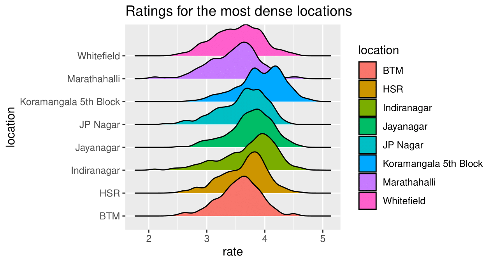
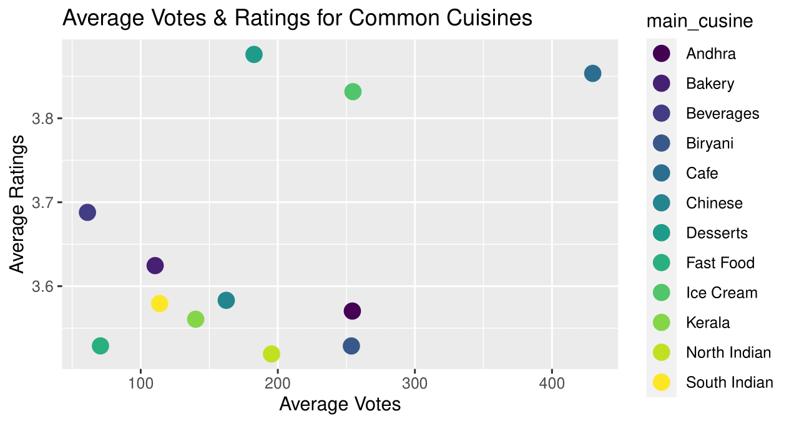
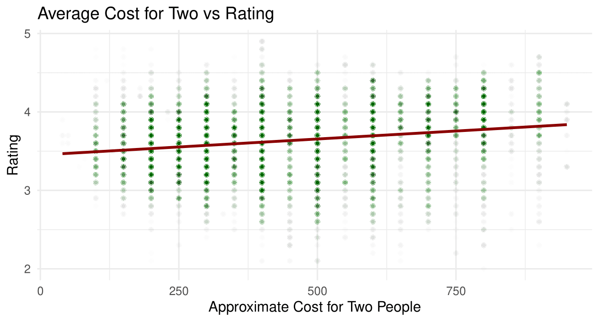
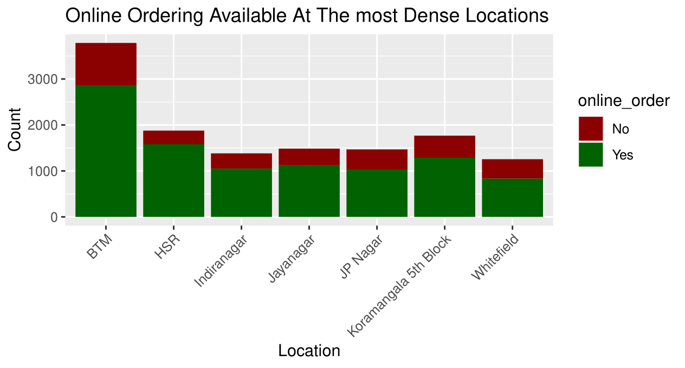
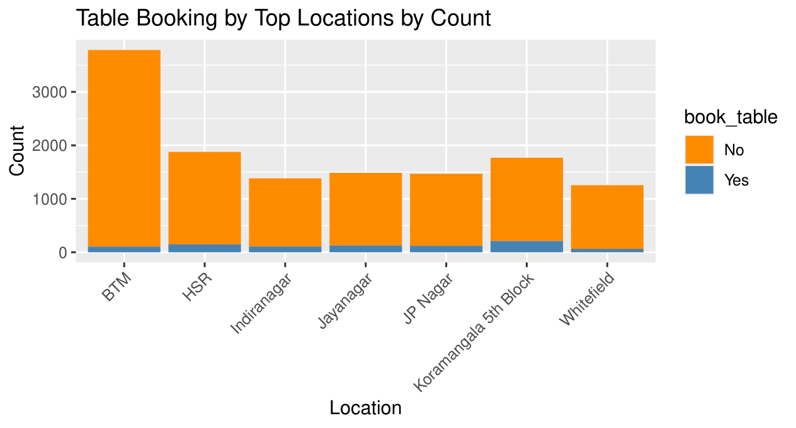

# Zomato-Restaurant-Analysis

So here's a fun project that may hopefully guarantee a great time out at dinner this weekend.

The Zomato app and website contain a wealth of interesting data on restaurants and eateries. Here are some insights from a dataset that covers my home city of Bangalore, the dataset itself comprises of _ entries and a number of different metrics for us to explore:

### Restaurants by location:

Here is a ridge plot that shows us the average ratings of restaurants (for those neighborhoods with the highest number of restaurants within them) 

We can see that most of the restaurants in these neighborhoods have their average ratings between 3-4. An interesting exception is Koramangla 5th block which shows two distinct peaks (with one containing higher ratings of over 4). Also interesting to note is the gradual slope of Whitefield's ridge, indicating a much more varied spread of ratings, and the distinctively sharp slope of HSR's ridge much closer to 4.

### Restaurants by Cusine:

_

### The Cost Factor

Other factors to consider are whether the restaurant allows one to book in advance and order online. 

Of course cost does play its part in deciding as well. We can see a clear linear relationship here between the average cost and rating of a restaurant. The slope is not extremley steep however, and is measured at _.

### Other Nitpicks

Other factors to consider are whether the restaurant allows one to book in advance and order online. The vast majority do not allow you to be able to book online via Zomato, and while online ordering is extremely common, it is not as ubiquitous as I imagined, especially in BTM, Koramangala, and Whitefield. Like in the first visualization, the graphs here again describe those areas with the highest number of restaurants

